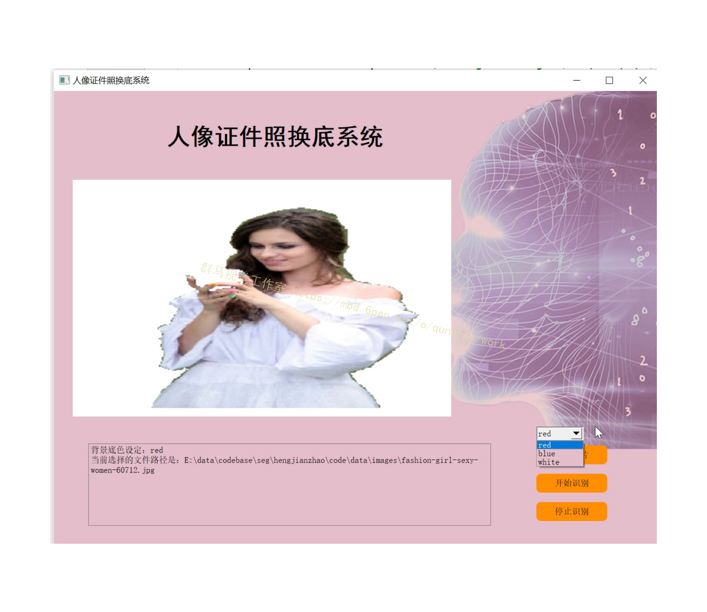
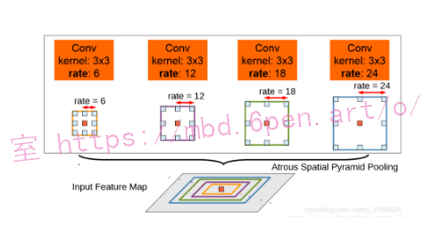

# 1.研究背景
针对人物证件照背景颜色替换即证件照自动换底问题，本文提出一种融合边缘检测与机器学习的自动换底算法。此方法先利用Canny算子对图像RGB颜色分量分别进行边缘检测，综合三个颜色分量的边缘检测结果获得边缘点。然后，找出由边缘点构成的最大连通分量，利用形态学膨胀运算连接最大连通分量中可能的断裂边缘，再结合先验知识和图像填充运算找出人物目标区域，并通过边缘检测获得目标区域的外轮廓。最后，对目标外轮廓膨胀数次后获得一个模板，将此模板运用到基于机器学习的抠图与图像合成算法中以实现人物证件照的自动换底。在一系列人物证件照上的实验结果证实了本文方法的有效性。

# 2.图片演示




# 3.视频演示

[基于改进FCN＆VGG的人像证件照换底系统_哔哩哔哩_bilibili](https://www.bilibili.com/video/BV1g8411s78D/)


# 4.目标外轮廓的提取
[参考博客方法](https://mbd.pub/o/bread/mbd-Y5qTm5tq)提取人物证件照中人体目标区域的外轮廓,即介于图像中人体目标和背景之间的边缘像素点构成的目标轮廓。从图1(e)或者图2(a)可以看到,RGB三个颜色分量边缘检测的叠加结果在检测到目标外轮廓点的同时,目标内部的非外轮廓点也被检测出来了。为了消除目标内部的非外轮廓点，我们先利用MATLAB自带的 bwlabel 函数标记八邻接结构下如图2(a)所示的二值化边缘图像中目标像素点(即白色边缘点)构成的每个连通分量,计算其对应的像素点数目,进而选出最大连通分量,构造最大连通分量二值图,其中,1代表属于最大连通分量的像素点,0代表其余像素点;然后,采用四邻接作为结构元素,利用MATLAB自带的形态学膨胀运算imdilate函数对最大连通分量二值图中的目标点(即边缘点)进行膨胀,以连通可能存在的断裂边缘点，膨胀后的最大连通分量二值图如图2(b)所示;接着,分别找膨胀后的最大连通分量二值图中第一列和最后一列的所有白色轮廓点中行坐标最小的那个点,分别视它们为左右肩膀与图像左右侧的交点,根据这两个点往下补充白色轮廓点，并将图像矩阵的最下面一行设置为白色轮廓,这样就可以得到如图2(c)所示的封闭的人物目标轮廓;最后,利用MATLAB自带的 imfill 函数填充孔洞,获得如图2(d)所示的人物目标区域，并再次利用Canny算子检测边缘以获得如图2(e)所示的目标区域外轮廓。


# 5.基于机器学习的掩膜值计算

[此步骤采用文献](https://afdian.net/item?plan_id=4f3ee9e2598f11eda83852540025c377)的思路结合所得模板(mask)来计算抠图和图像合成中所需的掩膜值α。文献[4]提出一种基于局部学习的数字抠图方法,它为图像中每个像素点训练一个基于强相关近邻点的局部alpha-color模型。如同其机器学习中其它局部学习方法能有效使用流形结构一样,alpha (o)估计中的局部学习也能探索由规则网格上图像像素点颜色构成的图像强度曲面的结构。值得注意的是,与普通的半监督学习问题不同的是,这里提及的近邻像素是由图像像素点在规则网格上的欧氏距离大小来决定的。在进行掩膜值α的估计过程中，首先假定每个像素的α值是其相关近邻像素点α值的线性组合,然后采用基于线性alpha-color模型的局部学习过程来确定线性组合的系数,最后通过核技巧把线性模型扩展为更一般的非线性模型。掩膜值α的具体计算过程参见文献[4]。对于给定的如图4(a)的证件照,结合步骤(3)自动生成的模板(mask),此步骤计算所得掩膜值α对应矩阵显示成图像如图4(c)所示。


# 6.改进FCN网络

在处理多尺度物体分割时，我们通常会有以下几种方式来操作：（(d)为DeepLabV2的图）

然而仅仅(在一个卷积分支网络下)使用 dilated convolution 去抓取多尺度物体是一个不正统的方法。比方说，我们用一个 HDC 的方法来获取一个大（近）车辆的信息，然而对于一个小（远）车辆的信息都不再受用。假设我们再去用小 dilated convolution 的方法重新获取小车辆的信息，则这么做非常的冗余。
*更多精品同类型项目，搜索群马视觉工作室*
基于港中文和商汤组的 PSPNet 里的 Pooling module （其网络同样获得当年的SOTA结果），ASPP 则在网络 decoder 上对于不同尺度上用不同大小的 dilation rate 来抓去多尺度信息，每个尺度则为一个独立的分支，在网络最后把他合并起来再接一个卷积层输出预测 label。这样的设计则有效避免了在 encoder 上冗余的信息的获取，直接关注与物体之间之内的相关性。

deeplabv2中的aspp如上图所示，在特征顶部映射图使用了四中不同采样率的空洞卷积。这表明以不同尺度采样时有效的，在Deeolabv3中向ASPP中添加了BN层。不同采样率的空洞卷积可以有效捕获多尺度信息，但会发现随着采样率的增加，滤波器有效权重（权重有效的应用在特征区域，而不是填充0）逐渐变小。


# 7. 代码实现
```
class ASPP(nn.Module):
    def __init__(self, in_channel=512, depth=256):
        super(ASPP,self).__init__()
        # global average pooling : init nn.AdaptiveAvgPool2d ;also forward torch.mean(,,keep_dim=True)
        self.mean = nn.AdaptiveAvgPool2d((1, 1))
        self.conv = nn.Conv2d(in_channel, depth, 1, 1)
        # k=1 s=1 no pad
        self.atrous_block1 = nn.Conv2d(in_channel, depth, 1, 1)
        self.atrous_block6 = nn.Conv2d(in_channel, depth, 3, 1, padding=6, dilation=6)
        self.atrous_block12 = nn.Conv2d(in_channel, depth, 3, 1, padding=12, dilation=12)
        self.atrous_block18 = nn.Conv2d(in_channel, depth, 3, 1, padding=18, dilation=18)
 
        self.conv_1x1_output = nn.Conv2d(depth * 5, depth, 1, 1)
 
    def forward(self, x):
        size = x.shape[2:]
 
        image_features = self.mean(x)
        image_features = self.conv(image_features)
        image_features = F.upsample(image_features, size=size, mode='bilinear')
 
        atrous_block1 = self.atrous_block1(x)
 
        atrous_block6 = self.atrous_block6(x)
 
        atrous_block12 = self.atrous_block12(x)
 
        atrous_block18 = self.atrous_block18(x)
 
        net = self.conv_1x1_output(torch.cat([image_features, atrous_block1, atrous_block6,
                                              atrous_block12, atrous_block18], dim=1))
        return net
```


# 8.数据集的采集和标注


# 9.系统整合
[下图源码＆环境部署视频教程＆数据集＆自定义UI界面](https://s.xiaocichang.com/s/1b45f1)

参考[博客《基于改进FCN＆VGG的人像证件照换底系统》](https://mbd.pub/o/qunma/work)


# 10.参考文献
[1]章毓晋编著. 图像工程 [M].清华大学出版社,2006.
[2]Levin Anat,Lischinski Dani,Weiss Yair.A Closed-Form Solution to Natural Image Matting[J].IEEE Transactions on Pattern Analysis and Machine Intelligence.2008,30(2).228-242.
[3]Christiansen O,Tai XC,Skjaelaaen I,等.Image segmentation using some piecewise constant level set methods with MBO type of projection[J].International Journal of Computer Vision.2007,73(1).
[4]Leo Grady,Thomas Schiwietz,Shmuel Aharon,等.Random Walks for Interactive Alpha-Matting[C].2005


---
#### 如果您需要更详细的【源码和环境部署教程】，除了通过【系统整合】小节的链接获取之外，还可以通过邮箱以下途径获取:
#### 1.请先在GitHub上为该项目点赞（Star），编辑一封邮件，附上点赞的截图、项目的中文描述概述（About）以及您的用途需求，发送到我们的邮箱
#### sharecode@yeah.net
#### 2.我们收到邮件后会定期根据邮件的接收顺序将【完整源码和环境部署教程】发送到您的邮箱。
#### 【免责声明】本文来源于用户投稿，如果侵犯任何第三方的合法权益，可通过邮箱联系删除。